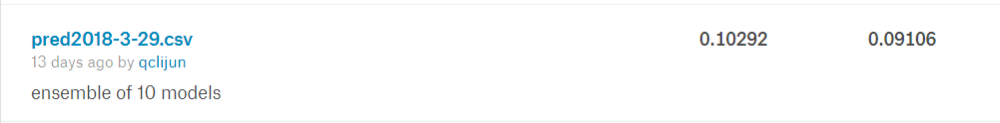
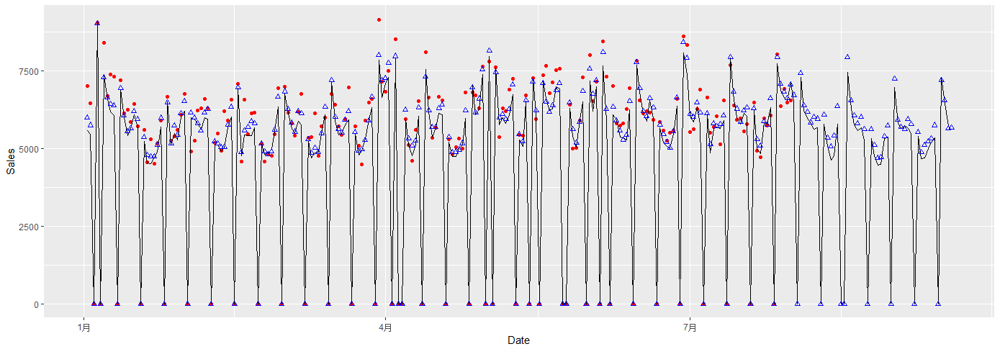

# rossmann-kaggle-udacity

----
[Kaggle Rossmann Store Sales](https://www.kaggle.com/c/rossmann-store-sales) 竞赛，我的深度神经网络模型，在Private LeaderBoard上评分~0.103, 能排到第二名。

## Requirements
项目中我使用R语言进行数据探索、可视化和特征工程等工作，R的版本是x64 3.4.3。需要安装的R包有：
- zoo 
- data.table
- rlist
- ggplot2
- rhdf5

我使用Python3.6 构建模型，需要安装的Python库有：
- numpy
- pandas
- matplotlib
- tensorflow
- keras
- xgboost
- lightgbm

## Run
1. 检查本项目应该包含以下子目录: googletrend, input, models, output, R, weather
2. 提取特征（如果直接使用output目录下的all_data.h5，则可以省略该步骤）： 
    - 改变工作目录至R子目录
    - 运行脚本data.R，这个过程大约需花费3到5分钟，它将在output目录下生成名为all_data.h5的特征文件。
3. 安装并配置Kaggle API, 参见 https://github.com/kaggle/kaggle-api
4. 简单XGBoost模型： ```python ross_xgb.py```
5. Entity-Embedding模型：
    - 修改ross_main.py的设置
    ```
    MODEL = NN_Embedding_Base
    N_NETWORKS = 1
    EPOCHS = 20
    ```
    - ```python ross_main.py```

6. EE-Residual模型：
    - 修改ross_main.py的设置
    ```
    MODEL = NN_Embedding
    N_NETWORKS = 1
    EPOCHS = 25
    ```
    - ```python ross_main.py```
    
7. EE-tree模型： ```python ross_ee_tree.py```
 
8. 最终提交的融合模型：
    - 修改ross_main.py的设置
    ```
    MODEL = NN_Embedding
    N_NETWORKS = 10
    EPOCHS = 25
    ```
    - ```python ross_main.py```

## Result

与 [Cheng Guo's Entity-Embedding模型](https://github.com/entron/entity-embedding-rossmann/tree/kaggle)对比（10模型融合）

| Model| Parameters    |  Private Score  | Public Score|
| --------| -----|---- |----|
| EE-Residual                  |  443     |   0.10292    |0.09106 |
| Cheng Guo's Entity-Embedding | 690      |   0.10583    |0.09563 |

 ---
 
 提交的结果
 


Store174 预测结果
 
 
 

